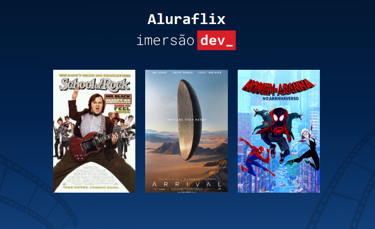

# Aluraflix - Catálogo de Filmes

## 🎬 Sobre o Projeto

Este projeto faz parte da **7ª edição da Imersão Dev da Alura**, desenvolvido durante a aula **"Explore estrutura de dados criando um catálogo de filmes"**. O objetivo é criar um catálogo simples e dinâmico de filmes utilizando apenas **HTML, CSS e JavaScript**, com foco no uso de **arrays** para armazenar e exibir dados.

O projeto exibe uma lista de filmes com suas capas e títulos, demonstrando conceitos fundamentais de programação como:
- Estrutura de dados (arrays)
- Laços de repetição (`for`)
- Manipulação dinâmica do conteúdo da página com `document.write`

---

## 🛠️ Tecnologias Utilizadas

- **HTML5** – Estrutura da página
- **CSS3** – Estilização e responsividade
- **JavaScript** – Lógica de exibição dos filmes

---

## 📦 Funcionalidades

✅ Exibição automática de filmes a partir de arrays  
✅ Títulos alinhados abaixo de cada imagem  
✅ Código limpo e didático, ideal para iniciantes  
✅ Design simples e responsivo

---
